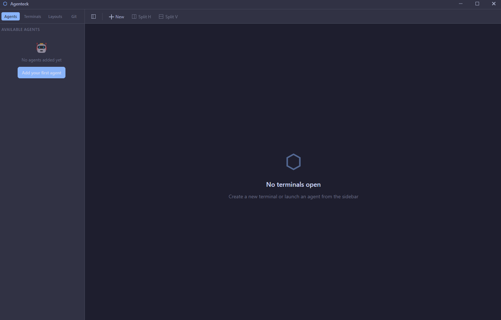
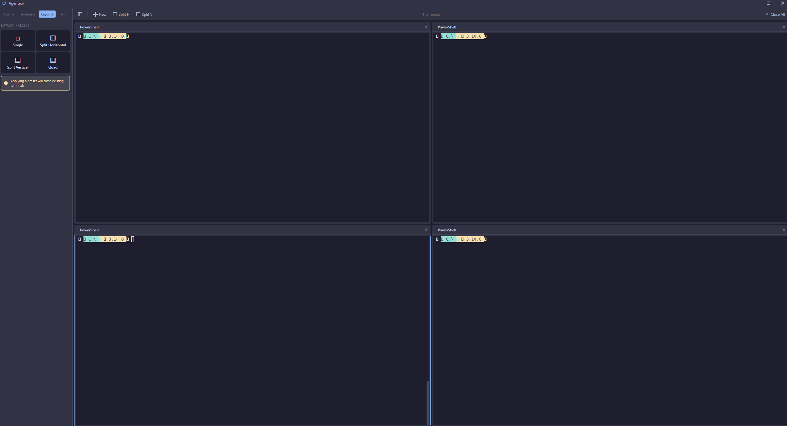
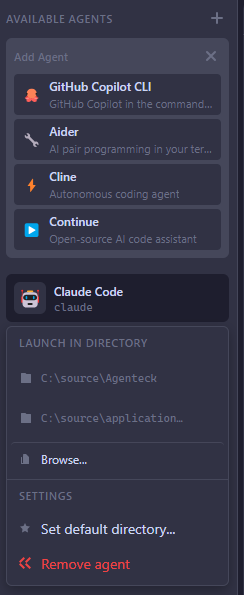

# Agenteck



[](LICENSE)
[](https://github.com/RichardLitt/standard-readme)

A desktop application for managing multiple CLI AI agents in a unified tiling interface.

Agenteck brings together Claude Code, GitHub Copilot, Gemini CLI, OpenCode, Codex, and Qwen into a single window with a flexible tiling layout. Each agent runs in its own terminal with full ANSI color support, clickable URLs, and persistent scrollback. Workspaces auto-save and restore, so you can pick up exactly where you left off.

## Table of Contents

- [Background](#background)
- [Install](#install)
- [Usage](#usage)
- [API](#api)
- [Contributing](#contributing)
- [License](#license)

## Background

Modern developers often use multiple AI coding assistants—Claude Code for complex refactoring, GitHub Copilot for quick commands, Gemini for multimodal tasks. Switching between terminal windows and managing layouts manually is tedious.

Agenteck provides:

- **Multi-Agent Support** — Launch Claude Code, GitHub Copilot, Gemini CLI, OpenCode, Codex, Qwen, or custom agents from a unified sidebar
- **Tiling Layout** — Drag-and-drop terminals into split views with resizable borders and layout presets
- **Terminal Emulation** — Powered by xterm.js with full ANSI colors, clickable URLs, Unicode, and scrollback
- **Workspace Persistence** — Layouts auto-save and restore on startup



### Tech Stack

| Layer | Technology |
|-------|------------|
| Desktop | Electron 34 |
| UI | React 18 + TypeScript |
| State | Zustand |
| Terminal | xterm.js + node-pty |
| Layout | react-mosaic-component |
| Build | Vite |

## Install

### Prerequisites

- [Node.js](https://nodejs.org/) 18+
- npm

### Quick Start

```bash
git clone https://github.com/isaiahdawkins12/Agenteck.git
cd Agenteck
npm run setup
agenteck start
```

The `agenteck` command is now available globally.

### Development

```bash
git clone https://github.com/isaiahdawkins12/Agenteck.git
cd Agenteck
npm install
npm run dev      # Starts Vite dev server + TypeScript watch
npm start        # In another terminal, starts Electron
```

### Building

```bash
npm run build              # Build for production
npm run package            # Package for current platform
npm run package:win        # Windows (NSIS + portable)
npm run package:mac        # macOS (DMG + ZIP)
npm run package:linux      # Linux (AppImage + DEB)
```

Packaged files output to `release/`.

## Usage

### CLI

```bash
agenteck start       # Start Agenteck (foreground)
agenteck start -d    # Start in background (detached)
agenteck stop        # Stop running instance
agenteck status      # Check if running
agenteck restart     # Restart Agenteck
agenteck help        # Show all commands
```

Without global install, use `npm run cli:start`, `npm run cli:stop`, etc.

### GUI



**Creating Terminals** — Click **+** in the header or use the sidebar.

**Launching Agents** — Open the Agents tab in the sidebar and click any agent to launch it in a new terminal.

**Managing Layout** — Drag terminals to split horizontally/vertically. Drag borders to resize. Use the Layouts tab for presets.

### Configuration

Config files are stored at:

- **Windows**: `%APPDATA%/agenteck-config/config.json`
- **macOS**: `~/Library/Application Support/agenteck-config/config.json`
- **Linux**: `~/.config/agenteck-config/config.json`

## API

### Architecture

```
src/
├── main/           # Electron main process
│   ├── main.ts     # Entry point, window management
│   ├── preload.ts  # Context bridge for IPC
│   ├── terminal/   # PTY process management
│   ├── config/     # Persistence (electron-store)
│   └── ipc/        # IPC handlers
├── renderer/       # React frontend
│   ├── components/ # UI components
│   ├── store/      # Zustand stores
│   ├── hooks/      # Custom hooks
│   └── styles/     # CSS
└── shared/         # Shared types & constants
```

### IPC Communication

The main and renderer processes communicate via typed IPC channels defined in `src/shared/types/ipc.ts`. The preload script exposes a safe API surface through `window.electronAPI`.

### State Management

Application state is managed with Zustand stores in `src/renderer/store/`:

- `terminalStore.ts` — Terminal instances and output buffers
- `layoutStore.ts` — Tiling layout configuration
- `settingsStore.ts` — User preferences and themes

## Contributing

See [CONTRIBUTING.md](CONTRIBUTING.md) for guidelines.

PRs accepted.

If editing this README, please conform to the [standard-readme](https://github.com/RichardLitt/standard-readme) specification.

## License

[MIT](LICENSE)
